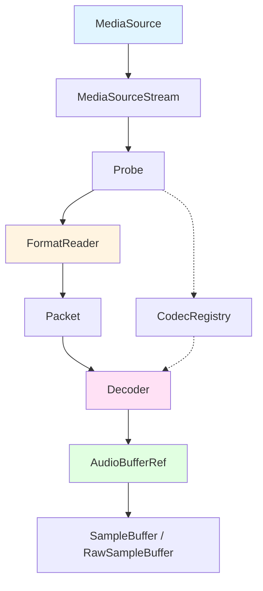
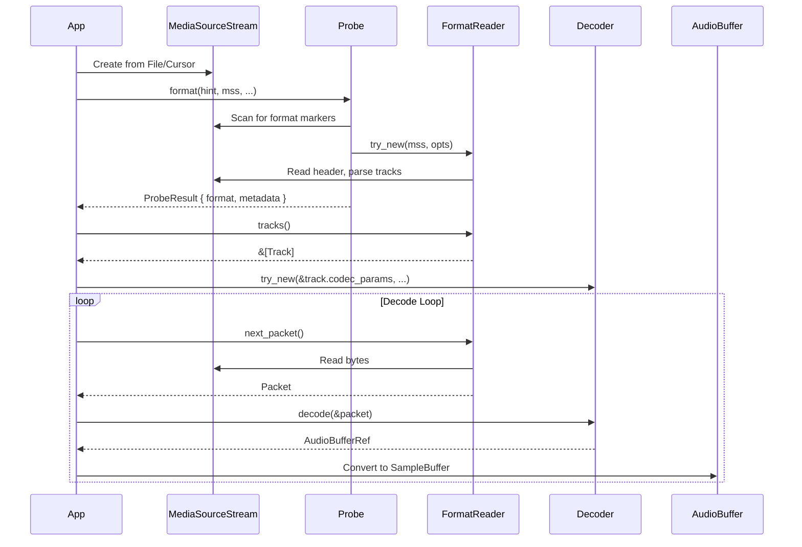

Symphonia is designed around a clear separation of concerns, with distinct boundaries between demuxing (reading container formats) and decoding (decompressing audio codecs). This architectural approach provides flexibility, modularity, and performance.

## Core Design Principles

Symphonia's architecture follows these key principles:

1. **Separation of demuxing and decoding** - Container formats and codecs are completely independent
2. **Trait-based abstractions** - Core functionality is defined through Rust traits
3. **Modular crate structure** - Features can be selectively enabled via crate features
4. **Type safety** - 100% safe Rust with strong type guarantees
5. **Zero-cost abstractions** - Generic programming with no runtime overhead

## Architectural Overview



## The Demuxing Layer

### FormatReader Trait

The `FormatReader` trait (`symphonia-core/src/formats.rs:168`) is the core abstraction for container format demuxers. All container formats (MP4, MKV, OGG, WAV, etc.) implement this trait.

<CodeGroup>
```rust Key Methods
pub trait FormatReader: Send + Sync {
    // Instantiate a format reader
    fn try_new(source: MediaSourceStream, options: &FormatOptions) -> Result<Self>;
    
    // Get the next packet from the container
    fn next_packet(&mut self) -> Result<Packet>;
    
    // Get track information
    fn tracks(&self) -> &[Track];
    
    // Seek to a timestamp
    fn seek(&mut self, mode: SeekMode, to: SeekTo) -> Result<SeekedTo>;
    
    // Get metadata
    fn metadata(&mut self) -> Metadata<'_>;
}
```

```rust Track Information
pub struct Track {
    pub id: u32,
    pub codec_params: CodecParameters,
    pub language: Option<String>,
}
```

```rust Packet Structure
pub struct Packet {
    track_id: u32,
    pub ts: u64,              // Timestamp
    pub dur: u64,             // Duration
    pub trim_start: u32,      // Gapless playback
    pub trim_end: u32,        // Gapless playback
    pub data: Box<[u8]>,      // Encoded data
}
```
</CodeGroup>

### Container Format Flow

1. **Initialization**: `FormatReader::try_new()` probes the container header and extracts track information
2. **Demuxing**: `next_packet()` returns the next encoded packet from any track
3. **Track Selection**: Caller filters packets by `track_id` to process specific tracks
4. **Seeking**: `seek()` moves to a different position in the stream

<Note>
The `FormatReader` returns packets from all tracks in the order they appear in the container. Your application must filter packets by `track_id` to process specific tracks.
</Note>

## The Decoding Layer

### Decoder Trait

The `Decoder` trait (`symphonia-core/src/codecs.rs:460`) abstracts audio codec decoders. Each codec (MP3, FLAC, Vorbis, AAC, etc.) implements this trait.

<CodeGroup>
```rust Key Methods
pub trait Decoder: Send + Sync {
    // Instantiate a decoder
    fn try_new(params: &CodecParameters, options: &DecoderOptions) -> Result<Self>;
    
    // Decode a packet into audio samples
    fn decode(&mut self, packet: &Packet) -> Result<AudioBufferRef<'_>>;
    
    // Reset decoder state after a seek
    fn reset(&mut self);
    
    // Get the last decoded buffer
    fn last_decoded(&self) -> AudioBufferRef<'_>;
}
```

```rust Codec Parameters
pub struct CodecParameters {
    pub codec: CodecType,
    pub sample_rate: Option<u32>,
    pub time_base: Option<TimeBase>,
    pub channels: Option<Channels>,
    pub channel_layout: Option<Layout>,
    // Gapless playback support
    pub delay: Option<u32>,
    pub padding: Option<u32>,
    // ... and more
}
```
</CodeGroup>

### Decoder Flow

1. **Instantiation**: Create decoder using `CodecParameters` from the track
2. **Decoding**: Feed `Packet`s to `decode()`, receive `AudioBufferRef`s
3. **Reset**: Call `reset()` after seeking to clear decoder state
4. **Export**: Convert `AudioBufferRef` to `SampleBuffer` for output

## Format and Codec Discovery

### The Probe

The `Probe` (`symphonia-core/src/probe.rs:194`) automatically detects container formats by scanning the byte stream for format markers.

```rust
let mut probe = Probe::default();

// Register all enabled formats
probe.register_all::<WavReader>();
probe.register_all::<Mp4Reader>();
probe.register_all::<OggReader>();

// Probe the stream
let probed = probe.format(&hint, mss, &fmt_opts, &meta_opts)?;
let mut format = probed.format; // FormatReader instance
```

### The CodecRegistry

The `CodecRegistry` (`symphonia-core/src/codecs.rs:524`) maps codec types to decoder implementations.

```rust
let mut registry = CodecRegistry::new();

// Register decoders
registry.register_all::<Mp3Decoder>();
registry.register_all::<FlacDecoder>();
registry.register_all::<VorbisDecoder>();

// Create decoder for a track
let decoder = registry.make(&track.codec_params, &dec_opts)?;
```

<Tip>
Use `symphonia::default::get_probe()` and `symphonia::default::get_codecs()` to get pre-populated registries with all enabled formats and codecs.
</Tip>

## Modular Crate Structure

Symphonia is organized into multiple crates to allow selective compilation:

<Tabs>
  <Tab title="Core">
    **`symphonia-core`** - The foundation library containing:
    - Trait definitions (`FormatReader`, `Decoder`)
    - Audio primitives (`AudioBuffer`, `SampleBuffer`)
    - I/O abstractions (`MediaSourceStream`)
    - Codec and format registries (`Probe`, `CodecRegistry`)
    - No actual format or codec implementations
  </Tab>
  
  <Tab title="Format Crates">
    **Format-specific crates** implement `FormatReader`:
    - `symphonia-format-mkv` - Matroska/WebM
    - `symphonia-format-ogg` - OGG container
    - `symphonia-format-isomp4` - MP4/M4A/MOV
    - `symphonia-format-riff` - WAV and AIFF
    - `symphonia-format-caf` - Core Audio Format
  </Tab>
  
  <Tab title="Codec Crates">
    **Codec-specific crates** implement `Decoder`:
    - `symphonia-codec-vorbis` - Vorbis
    - `symphonia-codec-aac` - AAC-LC
    - `symphonia-codec-alac` - Apple Lossless
    - `symphonia-codec-pcm` - PCM variants
    - `symphonia-codec-adpcm` - ADPCM variants
  </Tab>
  
  <Tab title="Bundles">
    **Bundle crates** combine format and codec:
    - `symphonia-bundle-mp3` - MP3 format + decoder
    - `symphonia-bundle-flac` - FLAC format + decoder
    
    These are used when the format only contains one codec type.
  </Tab>
  
  <Tab title="Umbrella">
    **`symphonia`** - The umbrella crate that:
    - Re-exports `symphonia-core`
    - Provides feature flags for all formats/codecs
    - Includes convenience registries in `symphonia::default`
  </Tab>
</Tabs>

### Feature Flags

Enable specific formats and codecs via Cargo features:

```toml
[dependencies]
symphonia = { version = "0.5", features = ["mp3", "aac", "flac"] }

# Or enable everything:
symphonia = { version = "0.5", features = ["all"] }

# Or by category:
symphonia = { version = "0.5", features = ["all-codecs", "all-formats"] }
```

## Complete Decode Pipeline

Here's how all the components work together:



## Key Architectural Benefits

<AccordionGroup>
  <Accordion title="Format/Codec Independence">
    Any codec bitstream can be stored in any compatible container. For example:
    - Vorbis audio in OGG, MKV, or WebM
    - AAC audio in MP4, ADTS, or MKV
    
    This separation means adding a new format automatically supports all existing codecs.
  </Accordion>
  
  <Accordion title="Type Safety & Performance">
    Rust's trait system provides:
    - **Compile-time polymorphism** via generics (zero overhead)
    - **Runtime polymorphism** via trait objects when needed
    - **Memory safety** without garbage collection
    - **Thread safety** via `Send + Sync` bounds
  </Accordion>
  
  <Accordion title="Selective Compilation">
    The modular crate structure allows:
    - Reduced binary size by excluding unused formats/codecs
    - Faster compile times for development
    - License compliance (exclude non-free codecs)
    - Platform-specific builds (WASM, embedded)
  </Accordion>
  
  <Accordion title="Extensibility">
    Adding new functionality is straightforward:
    - Implement `FormatReader` for a new container format
    - Implement `Decoder` for a new audio codec
    - Implement `MediaSource` for custom I/O sources
    - All existing code continues to work unchanged
  </Accordion>
</AccordionGroup>

## Next Steps

<CardGroup cols={2}>
  <Card title="Formats and Codecs" icon="file-audio" href="/concepts/formats-and-codecs">
    Learn about container formats vs codecs and how they work together
  </Card>
  <Card title="Audio Primitives" icon="waveform" href="/concepts/audio-primitives">
    Understand AudioBuffer, sample formats, and audio data handling
  </Card>
  <Card title="Media Sources" icon="folder-open" href="/concepts/media-sources">
    Deep dive into MediaSource, streaming, and buffering
  </Card>
  <Card title="Getting Started" icon="rocket" href="/getting-started/quickstart">
    See the architecture in action with a complete example
  </Card>
</CardGroup>