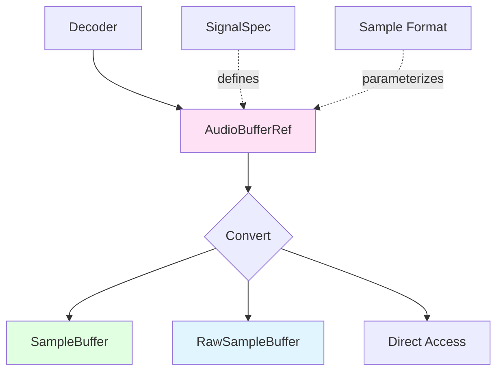

Symphonia provides a comprehensive set of primitives for working with decoded audio data. These primitives handle different sample formats, provide efficient planar audio storage, and enable safe conversion between formats.

## Core Audio Types

Symphonia's audio system is built around several key types:



## AudioBuffer and AudioBufferRef

### AudioBuffer\<S\>

`AudioBuffer<S>` (`symphonia-core/src/audio.rs:283`) is the fundamental audio container. It stores multi-channel audio in a **planar** format.

<CodeGroup>
```rust Structure
pub struct AudioBuffer<S: Sample> {
    buf: Vec<S>,           // All channel data
    spec: SignalSpec,      // Signal characteristics
    n_frames: usize,       // Number of frames written
    n_capacity: usize,     // Maximum frames
}
```

```rust Creating an AudioBuffer
use symphonia::core::audio::{AudioBuffer, SignalSpec, Channels};

// Define signal characteristics
let spec = SignalSpec::new(48000, Channels::FRONT_LEFT | Channels::FRONT_RIGHT);

// Create buffer with capacity for 4096 frames
let buffer = AudioBuffer::<f32>::new(4096, spec);
```

```rust Accessing Samples
use symphonia::core::audio::Signal;

// Get samples for a specific channel
let left_channel = buffer.chan(0);   // &[f32]
let right_channel = buffer.chan(1);  // &[f32]

// Get mutable access
let left_mut = buffer.chan_mut(0);   // &mut [f32]

// Get number of frames
let frame_count = buffer.frames();
```
</CodeGroup>

### Planar vs Interleaved Layout

<Tabs>
  <Tab title="Planar (AudioBuffer)">
    Samples are stored channel-by-channel:
    ```
    [L L L L L L L L] [R R R R R R R R]
     ^^^^^^^^^^^^^^     ^^^^^^^^^^^^^^
     Left channel       Right channel
    ```
    
    **Benefits:**
    - Cache-friendly for DSP operations
    - Easier to apply per-channel processing
    - Native format for most decoders
  </Tab>
  
  <Tab title="Interleaved (SampleBuffer)">
    Samples are stored frame-by-frame:
    ```
    [L R L R L R L R L R L R L R L R]
     ^^^ ^^^ ^^^ ^^^ ^^^ ^^^ ^^^ ^^^
     Frames (stereo pairs)
    ```
    
    **Benefits:**
    - Expected by most audio APIs (PortAudio, CPAL, etc.)
    - Easier to write to audio hardware
    - Natural for sample-aligned operations
  </Tab>
</Tabs>

### AudioBufferRef

`AudioBufferRef` (`symphonia-core/src/audio.rs:419`) is an **any-type** wrapper returned by decoders. It hides the specific sample format using an enum:

```rust
pub enum AudioBufferRef<'a> {
    U8(Cow<'a, AudioBuffer<u8>>),
    U16(Cow<'a, AudioBuffer<u16>>),
    U24(Cow<'a, AudioBuffer<u24>>),
    U32(Cow<'a, AudioBuffer<u32>>),
    S8(Cow<'a, AudioBuffer<i8>>),
    S16(Cow<'a, AudioBuffer<i16>>),
    S24(Cow<'a, AudioBuffer<i24>>),
    S32(Cow<'a, AudioBuffer<i32>>),
    F32(Cow<'a, AudioBuffer<f32>>),
    F64(Cow<'a, AudioBuffer<f64>>),
}
```

<Note>
Decoders return `AudioBufferRef` because different codecs produce different sample formats. Your application must handle this polymorphism.
</Note>

### Working with AudioBufferRef

<CodeGroup>
```rust Pattern Matching
let decoded = decoder.decode(&packet)?;

match decoded {
    AudioBufferRef::F32(buf) => {
        // Process f32 samples
        for &sample in buf.chan(0) {
            println!("Sample: {}", sample);
        }
    }
    AudioBufferRef::S16(buf) => {
        // Process i16 samples
    }
    _ => {
        // Handle other formats
    }
}
```

```rust Generic Access
// Get frames and capacity without pattern matching
let frames = decoded.frames();
let capacity = decoded.capacity();
let spec = decoded.spec();
```

```rust Using SampleBuffer (Recommended)
use symphonia::core::audio::SampleBuffer;

// Create a sample buffer (auto-converts any format)
let mut sample_buf = SampleBuffer::<f32>::new(
    decoded.capacity() as u64,
    *decoded.spec()
);

// Copy and convert to f32 interleaved
sample_buf.copy_interleaved_ref(decoded);

// Access as slice
let samples: &[f32] = sample_buf.samples();
```
</CodeGroup>

## Sample Formats

Symphonia supports all common audio sample formats via the `Sample` trait.

### Supported Sample Types

<Tabs>
  <Tab title="Integer">
    | Type | Bits | Range | Use Case |
    |------|------|-------|----------|
    | `u8` | 8 | 0 to 255 | Legacy formats, WAV |
    | `i8` | 8 | -128 to 127 | Telephony |
    | `u16` | 16 | 0 to 65535 | - |
    | `i16` | 16 | -32768 to 32767 | CD audio, most hardware |
    | `u24` | 24 | 0 to 16777215 | High-res audio |
    | `i24` | 24 | -8388608 to 8388607 | Studio recording |
    | `u32` | 32 | 0 to 4294967295 | - |
    | `i32` | 32 | -2147483648 to 2147483647 | Studio processing |
  </Tab>
  
  <Tab title="Floating Point">
    | Type | Bits | Range | Use Case |
    |------|------|-------|----------|
    | `f32` | 32 | -1.0 to 1.0 | DSP, modern DAWs |
    | `f64` | 64 | -1.0 to 1.0 | Scientific, high precision |
    
    <Note>
    Floating-point formats use normalized range [-1.0, 1.0] where 0.0 is silence.
    </Note>
  </Tab>
  
  <Tab title="Special">
    **`u24` and `i24`** are custom 24-bit integer types:
    
    ```rust
    use symphonia::core::sample::{u24, i24};
    
    let sample = i24::from_i32(8388607);
    let as_i32 = sample.to_i32();
    let bytes = sample.to_ne_bytes();  // [u8; 3]
    ```
    
    These types are used by some formats (FLAC, ALAC, high-res WAV) and are efficiently packed.
  </Tab>
</Tabs>

### Sample Trait

All sample types implement the `Sample` trait, which provides:

```rust
pub trait Sample: Copy + Clone + Send + Sync + ... {
    /// The equilibrium value (silence)
    const MID: Self;
    
    // Conversion traits are implemented separately
}
```

The `MID` constant represents silence:
- **Unsigned**: mid-point (128 for u8, 32768 for u16)
- **Signed**: zero (0)
- **Float**: zero (0.0)

### Sample Conversions

Symphonia provides automatic sample format conversion:

<CodeGroup>
```rust Using IntoSample
use symphonia::core::conv::IntoSample;

let i16_sample: i16 = 16384;
let f32_sample: f32 = i16_sample.into_sample();  // ≈ 0.5

let f32_sample: f32 = 0.5;
let i16_sample: i16 = f32_sample.into_sample();  // 16384
```

```rust Using FromSample
use symphonia::core::conv::FromSample;

let f32_sample = f32::from_sample(16384_i16);  // ≈ 0.5
let i16_sample = i16::from_sample(0.5_f32);    // 16384
```

```rust Conversion Rules
// Integer to Float: normalize to [-1.0, 1.0]
let f = i16_sample as f32 / i16::MAX as f32;

// Float to Integer: denormalize and clamp
let i = (f32_sample * i16::MAX as f32) as i16;

// Unsigned to Signed: shift by MID
let s = u16_sample as i32 - u16::MID as i32;
```
</CodeGroup>

## SampleBuffer

`SampleBuffer<S>` (`symphonia-core/src/audio.rs:717`) converts `AudioBufferRef` to a typed, interleaved sample buffer.

### Creating and Using SampleBuffer

<CodeGroup>
```rust Basic Usage
use symphonia::core::audio::SampleBuffer;

// Create buffer for decoded audio
let mut sample_buf = SampleBuffer::<f32>::new(
    decoded.capacity() as u64,
    *decoded.spec(),
);

// Copy interleaved (LRLRLR...)
sample_buf.copy_interleaved_ref(decoded);

// Access samples
let samples: &[f32] = sample_buf.samples();
let len = sample_buf.len();  // Total sample count
```

```rust Planar Layout
// Copy planar (LLL...RRR...)
sample_buf.copy_planar_ref(decoded);

// Now channels are stored contiguously
let num_channels = spec.channels.count();
let frames = sample_buf.len() / num_channels;
```

```rust Reusing Buffer
// SampleBuffer should be reused across decode loop
let mut sample_buf = SampleBuffer::<f32>::new(
    4096,
    SignalSpec::new(48000, Channels::FRONT_LEFT | Channels::FRONT_RIGHT),
);

loop {
    let packet = format.next_packet()?;
    let decoded = decoder.decode(&packet)?;
    
    // Reuse the same buffer
    sample_buf.copy_interleaved_ref(decoded);
    
    // Process samples...
}
```
</CodeGroup>

<Warning>
Always recreate `SampleBuffer` if you receive `Error::ResetRequired` from the decoder, as the signal spec may have changed.
</Warning>

## RawSampleBuffer

`RawSampleBuffer<S>` (`symphonia-core/src/audio.rs:997`) is like `SampleBuffer`, but provides samples as raw bytes.

### When to Use RawSampleBuffer

Use `RawSampleBuffer` when:
- Interfacing with C APIs
- Writing to file formats
- Sending over network sockets
- Working with FFI boundaries

<CodeGroup>
```rust Creating RawSampleBuffer
use symphonia::core::audio::RawSampleBuffer;

let mut raw_buf = RawSampleBuffer::<f32>::new(
    decoded.capacity() as u64,
    *decoded.spec(),
);

// Copy as interleaved bytes
raw_buf.copy_interleaved_ref(decoded);

// Get as byte slice
let bytes: &[u8] = raw_buf.as_bytes();
```

```rust Writing to File
use std::io::Write;

let mut file = std::fs::File::create("output.raw")?;

loop {
    let packet = format.next_packet()?;
    let decoded = decoder.decode(&packet)?;
    
    raw_buf.copy_interleaved_ref(decoded);
    file.write_all(raw_buf.as_bytes())?;
}
```

```rust FFI Example
extern "C" {
    fn audio_callback(data: *const u8, len: usize);
}

let bytes = raw_buf.as_bytes();
unsafe {
    audio_callback(bytes.as_ptr(), bytes.len());
}
```
</CodeGroup>

## SignalSpec

`SignalSpec` (`symphonia-core/src/audio.rs:164`) describes the characteristics of an audio signal.

```rust
pub struct SignalSpec {
    pub rate: u32,         // Sample rate in Hz
    pub channels: Channels, // Channel configuration
}
```

### Creating SignalSpec

<CodeGroup>
```rust Basic Construction
use symphonia::core::audio::{SignalSpec, Channels};

// Stereo at 44.1kHz
let spec = SignalSpec::new(
    44100,
    Channels::FRONT_LEFT | Channels::FRONT_RIGHT
);
```

```rust Using Layout
use symphonia::core::audio::Layout;

// 5.1 surround
let spec = SignalSpec::new_with_layout(48000, Layout::FivePointOne);
```

```rust From Track
// Get spec from codec parameters
let track = format.tracks().first().unwrap();
let rate = track.codec_params.sample_rate.unwrap();
let channels = track.codec_params.channels.unwrap();

let spec = SignalSpec::new(rate, channels);
```
</CodeGroup>

## Channels and Layouts

### Channels Bitmask

`Channels` (`symphonia-core/src/audio.rs:36`) is a bitmask representing channel configuration:

<CodeGroup>
```rust Common Configurations
use symphonia::core::audio::Channels;

// Mono
let mono = Channels::FRONT_LEFT;

// Stereo
let stereo = Channels::FRONT_LEFT | Channels::FRONT_RIGHT;

// 2.1 (Stereo + LFE)
let stereo_lfe = Channels::FRONT_LEFT 
               | Channels::FRONT_RIGHT 
               | Channels::LFE1;

// 5.1 Surround
let surround = Channels::FRONT_LEFT
             | Channels::FRONT_RIGHT
             | Channels::FRONT_CENTRE
             | Channels::REAR_LEFT
             | Channels::REAR_RIGHT
             | Channels::LFE1;
```

```rust Channel Operations
let channels = Channels::FRONT_LEFT | Channels::FRONT_RIGHT;

// Count channels
let count = channels.count();  // 2

// Iterate individual channels
for channel in channels.iter() {
    println!("Channel: {:?}", channel);
}

// Check if channel is present
if channels.contains(Channels::FRONT_LEFT) {
    println!("Has left channel");
}
```
</CodeGroup>

### Channel Layouts

Pre-defined layouts for common configurations:

```rust
pub enum Layout {
    Mono,           // Single center channel
    Stereo,         // Left + Right
    TwoPointOne,    // Left + Right + LFE
    FivePointOne,   // Front L/R/C + Rear L/R + LFE
}

// Convert to Channels
let channels = Layout::Stereo.into_channels();
```

## Signal Trait

The `Signal` trait (`symphonia-core/src/audio.rs:501`) provides methods for manipulating audio buffers:

<CodeGroup>
```rust Rendering
use symphonia::core::audio::Signal;

// Render silence
buffer.render_silence(Some(1024));

// Render with custom function
buffer.render(Some(1024), |planes, frame_idx| {
    for plane in planes.planes() {
        plane[frame_idx] = 0.0;  // Generate samples
    }
    Ok(())
})?;
```

```rust Transforming
// Apply gain
buffer.transform(|sample| sample * 0.5);

// Clip samples
buffer.transform(|sample| sample.clamp(-1.0, 1.0));
```

```rust Trimming
// Trim 100 frames from start, 50 from end
buffer.trim(100, 50);

// Shift (remove from start)
buffer.shift(100);

// Truncate (remove from end)
buffer.truncate(1000);
```
</CodeGroup>

## Best Practices

<AccordionGroup>
  <Accordion title="Always Reuse Buffers">
    Create `SampleBuffer` and `RawSampleBuffer` once and reuse them:
    
    ```rust
    // Good
    let mut sample_buf = SampleBuffer::<f32>::new(capacity, spec);
    loop {
        let decoded = decoder.decode(&packet)?;
        sample_buf.copy_interleaved_ref(decoded);  // Reuse
    }
    
    // Bad - allocates every iteration
    loop {
        let decoded = decoder.decode(&packet)?;
        let mut sample_buf = SampleBuffer::<f32>::new(capacity, spec);
        sample_buf.copy_interleaved_ref(decoded);
    }
    ```
  </Accordion>
  
  <Accordion title="Prefer f32 for Processing">
    Use `f32` samples for DSP operations:
    - Normalized range [-1.0, 1.0]
    - No overflow/underflow concerns
    - Native format for most audio libraries
    - Good precision for audio work
  </Accordion>
  
  <Accordion title="Handle Format Changes">
    Be prepared for `Error::ResetRequired`:
    
    ```rust
    match decoder.decode(&packet) {
        Ok(decoded) => { /* process */ }
        Err(Error::ResetRequired) => {
            // Recreate buffers with new spec
            decoder.reset();
            // Re-examine codec parameters
        }
        Err(e) => return Err(e),
    }
    ```
  </Accordion>
  
  <Accordion title="Use Direct Access When Possible">
    If you only need one channel or specific processing, access channels directly:
    
    ```rust
    // More efficient than copying to SampleBuffer
    match decoded {
        AudioBufferRef::F32(buf) => {
            let left = buf.chan(0);
            let right = buf.chan(1);
            // Process directly
        }
        _ => { /* handle other formats */ }
    }
    ```
  </Accordion>
</AccordionGroup>

## Next Steps

<CardGroup cols={2}>
  <Card title="Media Sources" icon="folder-open" href="/concepts/media-sources">
    Learn how Symphonia reads audio data from different sources
  </Card>
  <Card title="Decoding Audio" icon="play" href="/guides/decoding-audio">
    Complete guide to decoding audio files
  </Card>
  <Card title="Processing Audio" icon="waveform-lines" href="/guides/decoding-audio">
    Apply effects and transformations to decoded audio
  </Card>
  <Card title="Exporting Audio" icon="file-export" href="/guides/decoding-audio">
    Convert and export audio to different formats
  </Card>
</CardGroup>