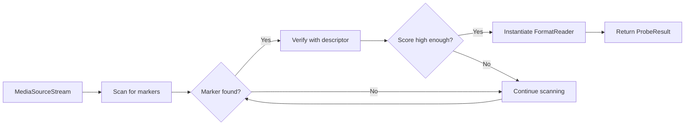

In multimedia, there's often confusion between container formats and audio codecs. Symphonia draws a clear distinction between these two concepts, which is fundamental to its architecture.

## Container Formats vs Audio Codecs

<Note>
**Container Format** = The box that holds the data  
**Audio Codec** = How the audio is compressed inside that box
</Note>

### Container Formats (Demuxers)

A container format is a file structure that encapsulates one or more codec bitstreams along with metadata. Think of it as an envelope that:

- **Wraps encoded data** in packets with timestamps and track IDs
- **Supports multiple tracks** (audio, video, subtitles)
- **Provides seeking** through timestamp indexes
- **Stores metadata** (artist, album, cover art)
- **Handles interleaving** of multiple streams

In Symphonia, container formats are represented by the `FormatReader` trait.

### Audio Codecs (Decoders)

An audio codec is an algorithm that compresses and decompresses audio data. A codec:

- **Compresses audio** to reduce file size (lossy or lossless)
- **Decompresses** back to PCM samples for playback
- **Has no knowledge** of containers, timestamps, or seeking
- **Processes packets** of compressed data

In Symphonia, audio codecs are represented by the `Decoder` trait.

## Format and Codec Relationships

Many combinations are possible:

<Tabs>
  <Tab title="Common Pairs">
    | File Extension | Container Format | Typical Codec(s) |
    |----------------|------------------|------------------|
    | `.mp3` | MP3 frames | MP3 (MPEG Layer 3) |
    | `.flac` | FLAC | FLAC |
    | `.m4a` | ISO/MP4 | AAC, ALAC |
    | `.ogg` | OGG | Vorbis, Opus |
    | `.opus` | OGG | Opus |
    | `.wav` | WAV (RIFF) | PCM, ADPCM |
    | `.mkv` | Matroska | Any (Vorbis, Opus, AAC, etc.) |
    | `.webm` | WebM (Matroska) | Vorbis, Opus |
  </Tab>
  
  <Tab title="One Codec, Many Containers">
    **Vorbis audio** can be stored in:
    - OGG container (`.ogg`)
    - Matroska container (`.mkv`, `.mka`)
    - WebM container (`.webm`)
    
    **AAC audio** can be stored in:
    - MP4 container (`.m4a`, `.mp4`)
    - ADTS raw format (`.aac`)
    - Matroska container (`.mkv`)
  </Tab>
  
  <Tab title="One Container, Many Codecs">
    **MP4 container** can hold:
    - AAC audio
    - ALAC audio
    - MP3 audio
    - Opus audio
    
    **Matroska container** can hold:
    - Vorbis audio
    - Opus audio
    - AAC audio
    - FLAC audio
    - PCM audio
  </Tab>
</Tabs>

## Format Detection

Symphonia uses the `Probe` to automatically detect container formats by scanning for byte-level markers.

### How Probe Works



### Format Descriptors

Each format provides a descriptor (`symphonia-core/src/probe.rs:100`) with:

```rust
pub struct Descriptor {
    pub short_name: &'static str,      // "mp3"
    pub long_name: &'static str,       // "MPEG Audio Layer 3"
    pub extensions: &'static [&'static str],  // ["mp3", "mp2", "mp1"]
    pub mime_types: &'static [&'static str],  // ["audio/mpeg"]
    pub markers: &'static [&'static [u8]],    // Byte signatures
    pub score: fn(&[u8]) -> u8,        // Confidence scorer
    pub inst: Instantiate,             // Instantiation function
}
```

### Providing Hints

You can help the probe by providing hints from external information:

<CodeGroup>
```rust File Extension Hint
let mut hint = Hint::new();
hint.with_extension("mp3");

let probed = probe.format(&hint, mss, &fmt_opts, &meta_opts)?;
```

```rust MIME Type Hint
let mut hint = Hint::new();
hint.mime_type("audio/ogg");

let probed = probe.format(&hint, mss, &fmt_opts, &meta_opts)?;
```

```rust Both Hints
let mut hint = Hint::new();
hint.with_extension("m4a")
    .mime_type("audio/mp4");

let probed = probe.format(&hint, mss, &fmt_opts, &meta_opts)?;
```
</CodeGroup>

<Warning>
Hints are advisory only. The probe will verify format markers regardless of hints to prevent misdetection.
</Warning>

## Codec Selection

Once a format is detected, you select a track and instantiate a decoder for its codec.

### Track Selection

```rust
use symphonia::core::codecs::CODEC_TYPE_NULL;

// Get all tracks from the container
let tracks = format.tracks();

// Find the first audio track with a known codec
let track = tracks
    .iter()
    .find(|t| t.codec_params.codec != CODEC_TYPE_NULL)
    .expect("no supported audio tracks");
```

### Codec Types

Symphonia defines codec types as constants (`symphonia-core/src/codecs.rs:23`):

<CodeGroup>
```rust Lossy Codecs
pub const CODEC_TYPE_VORBIS: CodecType;
pub const CODEC_TYPE_MP3: CodecType;
pub const CODEC_TYPE_MP2: CodecType;
pub const CODEC_TYPE_MP1: CodecType;
pub const CODEC_TYPE_AAC: CodecType;
pub const CODEC_TYPE_OPUS: CodecType;
```

```rust Lossless Codecs
pub const CODEC_TYPE_FLAC: CodecType;
pub const CODEC_TYPE_ALAC: CodecType;
pub const CODEC_TYPE_WAVPACK: CodecType;
```

```rust PCM Variants
pub const CODEC_TYPE_PCM_S16LE: CodecType;
pub const CODEC_TYPE_PCM_S24LE: CodecType;
pub const CODEC_TYPE_PCM_S32LE: CodecType;
pub const CODEC_TYPE_PCM_F32LE: CodecType;
// ... and many more
```
</CodeGroup>

### CodecRegistry

The `CodecRegistry` (`symphonia-core/src/codecs.rs:524`) maps codec types to decoder implementations:

```rust
use symphonia::default::get_codecs;

// Get the default registry with all enabled codecs
let codecs = get_codecs();

// Create a decoder for the track
let decoder = codecs.make(&track.codec_params, &dec_opts)?;
```

## Supported Formats and Codecs

Symphonia supports a wide range of formats and codecs. Support is categorized by quality status.

### Format Support (Demuxers)

<Tabs>
  <Tab title="Default Enabled">
    | Format | Status | Gapless | Feature Flag |
    |--------|--------|---------|-------------|
    | **Wave** | Excellent | Yes | `wav` |
    | **OGG** | Great | Yes | `ogg` |
    | **MKV/WebM** | Good | No | `mkv` |
    | **ADPCM** | Good | Yes | `adpcm` |
    | **PCM** | Excellent | Yes | `pcm` |
    | **Vorbis** | Excellent | Yes | `vorbis` |
    | **FLAC** | Excellent | Yes | `flac` |
  </Tab>
  
  <Tab title="Optional">
    | Format | Status | Gapless | Feature Flag |
    |--------|--------|---------|-------------|
    | **AIFF** | Great | Yes | `aiff` |
    | **CAF** | Good | No | `caf` |
    | **ISO/MP4** | Great | No | `isomp4` |
    | **MP3** | Excellent | Yes | `mp3` |
    | **AAC-LC** | Great | No | `aac` |
    | **ALAC** | Great | Yes | `alac` |
  </Tab>
  
  <Tab title="Status Meanings">
    | Status | Meaning |
    |--------|--------|
    | **Excellent** | All streams play perfectly. Passes compliance tests. No glitches. |
    | **Great** | Most streams play. Inaudible glitches may exist. Production ready. |
    | **Good** | Many streams play. Some may error or glitch. Use with testing. |
    | **-** | In development or not started. |
    
    A status of **Great** or higher is recommended for production use.
  </Tab>
</Tabs>

### Codec Support (Decoders)

| Codec | Status | Gapless | Feature Flag | Default |
|-------|--------|---------|--------------|--------|
| **FLAC** | Excellent | Yes | `flac` | Yes |
| **MP3** | Excellent | Yes | `mp3`, `mpa` | No |
| **Vorbis** | Excellent | Yes | `vorbis` | Yes |
| **PCM** | Excellent | Yes | `pcm` | Yes |
| **MP2** | Great | No | `mp2`, `mpa` | No |
| **MP1** | Great | No | `mp1`, `mpa` | No |
| **AAC-LC** | Great | No | `aac` | No |
| **ALAC** | Great | Yes | `alac` | No |
| **ADPCM** | Good | Yes | `adpcm` | Yes |

<Tip>
Enable all formats with `all-formats` feature flag, all codecs with `all-codecs`, or everything with `all`.
</Tip>

## Gapless Playback

Gapless playback removes encoder delay (padding at start) and encoder padding (at end) to enable seamless track transitions.

### Enabling Gapless

```rust
use symphonia::core::formats::FormatOptions;

let fmt_opts = FormatOptions {
    enable_gapless: true,
    ..Default::default()
};

let probed = probe.format(&hint, mss, &fmt_opts, &meta_opts)?;
```

### How It Works

When gapless is enabled:

1. **FormatReader** provides trim information in packets:
   ```rust
   packet.trim_start  // Frames to trim from start
   packet.trim_end    // Frames to trim from end
   ```

2. **Decoder** returns full audio buffer

3. **Application** trims samples based on trim values:
   ```rust
   let decoded = decoder.decode(&packet)?;
   
   // Trim samples if needed
   if packet.trim_start > 0 || packet.trim_end > 0 {
       decoded.trim(packet.trim_start as usize, packet.trim_end as usize);
   }
   ```

### Gapless Support by Format/Codec

Both the format and codec must support gapless:

| Combination | Gapless? | Notes |
|-------------|----------|-------|
| MP3 in MP3 | Yes | Excellent gapless support |
| FLAC in FLAC | Yes | Excellent gapless support |
| Vorbis in OGG | Yes | Excellent gapless support |
| AAC in MP4 | No | Format doesn't provide trim info yet |
| Opus in OGG | No | Not yet implemented |
| PCM in WAV | Yes | No compression, inherently gapless |

## Custom Formats and Codecs

You can add support for custom formats or codecs.

### Implementing a Custom Format

<Steps>
  <Step title="Implement FormatReader">
    ```rust
    use symphonia_core::formats::{FormatReader, FormatOptions};
    use symphonia_core::io::MediaSourceStream;
    
    pub struct MyFormatReader {
        // Your state
    }
    
    impl FormatReader for MyFormatReader {
        fn try_new(source: MediaSourceStream, options: &FormatOptions) -> Result<Self> {
            // Parse format header
            // Extract tracks
            // Return reader instance
        }
        
        fn next_packet(&mut self) -> Result<Packet> {
            // Read next packet from stream
        }
        
        // Implement other required methods...
    }
    ```
  </Step>
  
  <Step title="Create a Descriptor">
    ```rust
    use symphonia_core::probe::{Descriptor, QueryDescriptor};
    
    impl QueryDescriptor for MyFormatReader {
        fn query() -> &'static [Descriptor] {
            &[
                Descriptor {
                    short_name: "myformat",
                    long_name: "My Custom Format",
                    extensions: &["myf"],
                    mime_types: &["audio/myformat"],
                    markers: &[b"MYFORMAT"],  // Format signature
                    score: Self::score,
                    inst: Instantiate::Format(|source, opt| {
                        Ok(Box::new(Self::try_new(source, opt)?))
                    }),
                },
            ]
        }
        
        fn score(context: &[u8]) -> u8 {
            // Return confidence score 0-255
        }
    }
    ```
  </Step>
  
  <Step title="Register with Probe">
    ```rust
    let mut probe = Probe::default();
    probe.register_all::<MyFormatReader>();
    
    let probed = probe.format(&hint, mss, &fmt_opts, &meta_opts)?;
    ```
  </Step>
</Steps>

### Implementing a Custom Codec

<Steps>
  <Step title="Implement Decoder">
    ```rust
    use symphonia_core::codecs::{Decoder, CodecParameters};
    use symphonia_core::audio::AudioBufferRef;
    
    pub struct MyDecoder {
        // Your decoder state
    }
    
    impl Decoder for MyDecoder {
        fn try_new(params: &CodecParameters, options: &DecoderOptions) -> Result<Self> {
            // Initialize decoder with parameters
        }
        
        fn decode(&mut self, packet: &Packet) -> Result<AudioBufferRef<'_>> {
            // Decode packet data to PCM samples
        }
        
        fn reset(&mut self) {
            // Reset decoder state
        }
        
        // Implement other required methods...
    }
    ```
  </Step>
  
  <Step title="Register with CodecRegistry">
    ```rust
    let mut registry = CodecRegistry::new();
    registry.register_all::<MyDecoder>();
    
    let decoder = registry.make(&track.codec_params, &dec_opts)?;
    ```
  </Step>
</Steps>

## Next Steps

<CardGroup cols={2}>
  <Card title="Architecture" icon="sitemap" href="/concepts/architecture">
    Understand how formats and codecs fit into Symphonia's architecture
  </Card>
  <Card title="Audio Primitives" icon="waveform" href="/concepts/audio-primitives">
    Learn about AudioBuffer and sample format handling
  </Card>
  <Card title="Media Sources" icon="folder-open" href="/concepts/media-sources">
    Understand how Symphonia reads from different sources
  </Card>
  <Card title="Decoding Audio" icon="play" href="/guides/decoding-audio">
    Complete guide to decoding audio with Symphonia
  </Card>
</CardGroup>