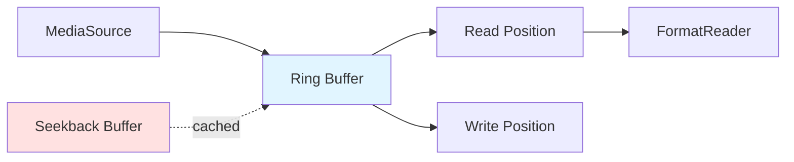

Symphonia provides a sophisticated I/O layer that abstracts over different input sources while optimizing for performance. Understanding this layer is key to efficiently reading audio from files, network streams, or custom sources.

## MediaSource Trait

The `MediaSource` trait (`symphonia-core/src/io/mod.rs:42`) is the foundation of Symphonia's I/O system.

```rust
pub trait MediaSource: io::Read + io::Seek + Send + Sync {
    /// Returns if the source is seekable
    fn is_seekable(&self) -> bool;
    
    /// Returns the length in bytes, if available
    fn byte_len(&self) -> Option<u64>;
}
```

<Note>
Despite requiring `io::Seek`, seeking is **optional**. The `is_seekable()` method indicates at runtime whether seeking is supported.
</Note>

## Built-in MediaSource Implementations

### File Sources

The most common source is `std::fs::File`:

<CodeGroup>
```rust Basic File
use std::fs::File;
use symphonia::core::io::MediaSourceStream;

// Open file
let file = File::open("audio.mp3")?;

// Wrap in MediaSourceStream
let mss = MediaSourceStream::new(Box::new(file), Default::default());
```

```rust With Options
use symphonia::core::io::MediaSourceStreamOptions;

let file = File::open("audio.flac")?;

let options = MediaSourceStreamOptions {
    buffer_len: 128 * 1024,  // 128KB buffer (must be power of 2)
};

let mss = MediaSourceStream::new(Box::new(file), options);
```
</CodeGroup>

### Memory Sources

Use `io::Cursor` for in-memory data:

<CodeGroup>
```rust From Vec<u8>
use std::io::Cursor;

let data: Vec<u8> = download_audio()?;
let cursor = Cursor::new(data);
let mss = MediaSourceStream::new(Box::new(cursor), Default::default());
```

```rust From Slice
// Note: Cursor<&[u8]> requires the slice to outlive the stream
let data: &[u8] = include_bytes!("audio.ogg");
let cursor = Cursor::new(data);
let mss = MediaSourceStream::new(Box::new(cursor), Default::default());
```
</CodeGroup>

### Non-Seekable Sources (ReadOnlySource)

For sources that only implement `Read` (like stdin, network streams), use `ReadOnlySource` (`symphonia-core/src/io/mod.rs:94`):

<CodeGroup>
```rust Standard Input
use symphonia::core::io::ReadOnlySource;
use std::io::stdin;

let source = ReadOnlySource::new(stdin());
let mss = MediaSourceStream::new(Box::new(source), Default::default());
```

```rust HTTP Stream
use reqwest::blocking::Response;

let response: Response = reqwest::blocking::get("https://example.com/audio.mp3")?;
let source = ReadOnlySource::new(response);
let mss = MediaSourceStream::new(Box::new(source), Default::default());
```

```rust Custom Reader
struct MyReader {
    // Your custom I/O implementation
}

impl std::io::Read for MyReader {
    fn read(&mut self, buf: &mut [u8]) -> io::Result<usize> {
        // Your read implementation
    }
}

let reader = MyReader { /* ... */ };
let source = ReadOnlySource::new(reader);
let mss = MediaSourceStream::new(Box::new(source), Default::default());
```
</CodeGroup>

<Warning>
Non-seekable sources have limitations:
- Cannot use seek operations
- Format detection must rely on sequential markers
- Some formats may fail to parse without seeking
</Warning>

## MediaSourceStream

`MediaSourceStream` (`symphonia-core/src/io/media_source_stream.rs:52`) is Symphonia's **supercharged buffered reader**. It wraps any `MediaSource` and provides:

1. **Exponential read-ahead buffering**
2. **Ring buffer for backward seeking**
3. **Efficient byte and bit reading**
4. **Vectored I/O for efficiency**

### Architecture



### Buffering Strategy

<Tabs>
  <Tab title="Read-Ahead">
    `MediaSourceStream` uses **exponential growth** for read-ahead:
    
    - **Initial**: 1 KB per fetch
    - **Maximum**: 32 KB per fetch
    - **Growth**: Doubles on each sequential read
    
    This minimizes:
    - System call overhead on sequential reads
    - Excess buffering on frequent seeks
    
    ```rust
    // Starts at 1KB
    const MIN_BLOCK_LEN: usize = 1 * 1024;
    // Grows to 32KB
    const MAX_BLOCK_LEN: usize = 32 * 1024;
    ```
  </Tab>
  
  <Tab title="Ring Buffer">
    The **ring buffer** enables backward seeking without re-reading:
    
    - **Default size**: 64 KB (configurable)
    - **Must be power of 2**
    - **Supports wrap-around**
    
    Seekback capacity:
    ```
    max_seekback = buffer_len - MAX_BLOCK_LEN
                 = 64KB - 32KB
                 = 32KB
    ```
    
    <Note>
    Regular `seek()` calls (via `io::Seek`) invalidate the buffer. Use `seek_buffered()` for efficient local seeking.
    </Note>
  </Tab>
  
  <Tab title="Vectored I/O">
    When a read spans the ring buffer boundary:
    
    ```
    Ring Buffer:
    [####________########]
          ^             ^
          write        read
    ```
    
    `MediaSourceStream` uses **vectored I/O** to read into both contiguous regions in one system call:
    
    ```rust
    let ring_vectors = &mut [
        IoSliceMut::new(vec0),  // From write pos to end
        IoSliceMut::new(vec1),  // From start to needed length
    ];
    self.inner.read_vectored(ring_vectors)?;
    ```
  </Tab>
</Tabs>

### MediaSourceStreamOptions

```rust
pub struct MediaSourceStreamOptions {
    /// The maximum buffer size. Must be a power of 2. Must be > 32kB.
    pub buffer_len: usize,
}
```

<CodeGroup>
```rust Default (64KB)
let mss = MediaSourceStream::new(
    Box::new(file),
    Default::default()  // 64KB buffer
);
```

```rust Custom Buffer Size
let options = MediaSourceStreamOptions {
    buffer_len: 256 * 1024,  // 256KB (must be power of 2)
};

let mss = MediaSourceStream::new(Box::new(file), options);
```

```rust Validation
// These will panic:
let bad1 = MediaSourceStreamOptions { buffer_len: 100 };  // Not power of 2
let bad2 = MediaSourceStreamOptions { buffer_len: 16 * 1024 };  // < 32KB

// These are valid:
let good1 = MediaSourceStreamOptions { buffer_len: 64 * 1024 };   // 64KB ✓
let good2 = MediaSourceStreamOptions { buffer_len: 128 * 1024 };  // 128KB ✓
let good3 = MediaSourceStreamOptions { buffer_len: 1024 * 1024 }; // 1MB ✓
```
</CodeGroup>

## Seekable vs Non-Seekable Sources

### Checking Seekability

```rust
let mss = MediaSourceStream::new(Box::new(source), Default::default());

if mss.is_seekable() {
    println!("Source supports seeking");
    if let Some(len) = mss.byte_len() {
        println!("Source length: {} bytes", len);
    }
} else {
    println!("Source is stream-only (no seeking)");
}
```

### Behavior Differences

<Tabs>
  <Tab title="Seekable">
    **Sources**: `File`, `Cursor<Vec<u8>>`, `Cursor<&[u8]>`
    
    **Capabilities**:
    - Full seeking support via `seek()`
    - Known byte length via `byte_len()`
    - Format readers can use seek indexes
    - Can jump to any position in the stream
    
    **Use Cases**:
    - Local audio files
    - Embedded audio resources
    - Downloaded audio in memory
  </Tab>
  
  <Tab title="Non-Seekable">
    **Sources**: `ReadOnlySource<stdin>`, `ReadOnlySource<TcpStream>`, HTTP streams
    
    **Capabilities**:
    - Sequential reading only
    - Unknown total length
    - Limited backward seeking (within buffer)
    - Format detection must use markers
    
    **Limitations**:
    - Cannot use `seek()` from `io::Seek`
    - Some formats may fail (e.g., formats with end-of-file metadata)
    - Cannot build seek indexes
    
    **Use Cases**:
    - Live streams
    - Network radio
    - Piped audio data
    - Real-time audio processing
  </Tab>
</Tabs>

## Buffered Seeking

For efficient local seeking within the buffered region, use `SeekBuffered` trait methods:

```rust
use symphonia::core::io::SeekBuffered;

// Seek to absolute position (within buffer)
let new_pos = mss.seek_buffered(1024);

// Seek relative to current position
let new_pos = mss.seek_buffered_rel(512);   // Forward 512 bytes
let new_pos = mss.seek_buffered_rel(-256);  // Backward 256 bytes

// Seek backward (convenience method)
mss.seek_buffered_rev(128);  // Go back 128 bytes

// Check buffer state
let can_seek_back = mss.read_buffer_len();    // Bytes available backward
let can_seek_fwd = mss.unread_buffer_len();   // Bytes available forward

// Ensure seekback capacity
mss.ensure_seekback_buffer(4096);  // Ensure 4KB seekback
```

<Warning>
`seek_buffered()` operations are clamped to the buffered region. If you seek beyond the buffer, the position is clamped to the buffer boundary.
</Warning>

## Advanced Reading Methods

Symphonia provides extensive I/O methods via the `ReadBytes` trait:

<Tabs>
  <Tab title="Basic Reading">
    ```rust
    use symphonia::core::io::ReadBytes;
    
    // Read single bytes
    let byte = mss.read_byte()?;          // u8
    let signed = mss.read_i8()?;          // i8
    
    // Read integers (little-endian by default)
    let val16 = mss.read_u16()?;          // u16 LE
    let val32 = mss.read_u32()?;          // u32 LE
    let val64 = mss.read_u64()?;          // u64 LE
    
    // Read integers (big-endian)
    let val16_be = mss.read_be_u16()?;    // u16 BE
    let val32_be = mss.read_be_u32()?;    // u32 BE
    
    // Read 24-bit integers
    let val24 = mss.read_u24()?;          // u24 as u32
    let val24_be = mss.read_be_u24()?;    // u24 BE as u32
    ```
  </Tab>
  
  <Tab title="Floating Point">
    ```rust
    // Read IEEE-754 floats
    let f32_val = mss.read_f32()?;        // f32 LE
    let f64_val = mss.read_f64()?;        // f64 LE
    
    let f32_be = mss.read_be_f32()?;      // f32 BE
    let f64_be = mss.read_be_f64()?;      // f64 BE
    ```
  </Tab>
  
  <Tab title="Bulk Reads">
    ```rust
    // Read into buffer (up to buf.len())
    let mut buf = [0u8; 1024];
    let bytes_read = mss.read_buf(&mut buf)?;
    
    // Read exact amount (errors if EOF)
    let mut buf = [0u8; 1024];
    mss.read_buf_exact(&mut buf)?;
    
    // Read into boxed slice
    let data = mss.read_boxed_slice(1024)?;      // Best effort
    let data = mss.read_boxed_slice_exact(1024)?; // Exact
    ```
  </Tab>
  
  <Tab title="Scanning">
    ```rust
    // Scan for byte pattern
    let pattern = b"\xFF\xFB";
    let mut buf = [0u8; 4096];
    let found = mss.scan_bytes(pattern, &mut buf)?;
    
    // Scan on aligned boundaries
    let pattern = b"\x00\x00\x01";
    let align = 4;  // Align to 4-byte boundaries
    let found = mss.scan_bytes_aligned(pattern, align, &mut buf)?;
    ```
  </Tab>
  
  <Tab title="Ignoring Bytes">
    ```rust
    // Skip bytes efficiently
    mss.ignore_bytes(1024)?;
    
    // Get current position
    let pos = mss.pos();
    ```
  </Tab>
</Tabs>

## Bit Reading

Some codecs (like MP3, AAC) require bit-level reading. Symphonia provides bit readers:

<CodeGroup>
```rust Left-to-Right (MSB first)
use symphonia::core::io::{BitReaderLtr, ReadBitsLtr};

let mut br = BitReaderLtr::new(&packet.data);

let bits = br.read_bits_leq32(5)?;   // Read 5 bits
let flag = br.read_bool()?;          // Read 1 bit as bool
let signed = br.read_bits_leq32_signed(8)?;  // Read signed

// Ignore bits
br.ignore_bits(3)?;

// Check alignment
if !br.is_aligned() {
    br.realign();  // Advance to byte boundary
}
```

```rust Right-to-Left (LSB first)
use symphonia::core::io::{BitReaderRtl, ReadBitsRtl};

let mut br = BitReaderRtl::new(&packet.data);

let bits = br.read_bits_leq32(5)?;   // Read 5 bits
let flag = br.read_bool()?;          // Read 1 bit as bool
```
</CodeGroup>

## Custom MediaSource Implementation

You can implement `MediaSource` for custom I/O scenarios:

```rust
use std::io::{self, Read, Seek, SeekFrom};
use symphonia::core::io::MediaSource;

struct CustomSource {
    data: Vec<u8>,
    pos: usize,
}

impl Read for CustomSource {
    fn read(&mut self, buf: &mut [u8]) -> io::Result<usize> {
        let remaining = self.data.len() - self.pos;
        let to_read = buf.len().min(remaining);
        
        buf[..to_read].copy_from_slice(&self.data[self.pos..self.pos + to_read]);
        self.pos += to_read;
        
        Ok(to_read)
    }
}

impl Seek for CustomSource {
    fn seek(&mut self, pos: SeekFrom) -> io::Result<u64> {
        let new_pos = match pos {
            SeekFrom::Start(n) => n as i64,
            SeekFrom::Current(n) => self.pos as i64 + n,
            SeekFrom::End(n) => self.data.len() as i64 + n,
        };
        
        if new_pos < 0 || new_pos > self.data.len() as i64 {
            return Err(io::Error::new(io::ErrorKind::InvalidInput, "seek out of bounds"));
        }
        
        self.pos = new_pos as usize;
        Ok(self.pos as u64)
    }
}

impl MediaSource for CustomSource {
    fn is_seekable(&self) -> bool {
        true
    }
    
    fn byte_len(&self) -> Option<u64> {
        Some(self.data.len() as u64)
    }
}
```

## Performance Considerations

<AccordionGroup>
  <Accordion title="Buffer Size Selection">
    Choose buffer size based on use case:
    
    | Use Case | Recommended Size | Reason |
    |----------|------------------|--------|
    | **Local files** | 64-128 KB | Default is fine |
    | **Network streams** | 256 KB - 1 MB | Reduce network overhead |
    | **Low latency** | 32-64 KB | Minimize buffering delay |
    | **Embedded/WASM** | 32-64 KB | Reduce memory usage |
    | **Large files** | 128-256 KB | Amortize syscall overhead |
    
    Remember: Must be power of 2, > 32 KB.
  </Accordion>
  
  <Accordion title="Seekback Buffer">
    The seekback buffer allows efficient backward seeking:
    
    ```rust
    // Ensure you can seek back 16KB
    mss.ensure_seekback_buffer(16 * 1024);
    
    // Now you can efficiently seek backward
    mss.seek_buffered_rev(8 * 1024);  // No I/O needed
    ```
    
    Useful for:
    - Format probing that needs to retry
    - Decoders that need lookahead/lookbehind
    - Error recovery with retries
  </Accordion>
  
  <Accordion title="Avoid Excessive Seeking">
    Each `seek()` call via `io::Seek` invalidates the buffer:
    
    ```rust
    // Bad - buffer invalidated each time
    for offset in offsets {
        mss.seek(SeekFrom::Start(offset))?;
        let byte = mss.read_byte()?;
    }
    
    // Better - use buffered seeking if possible
    for offset in offsets {
        mss.seek_buffered(offset);
        let byte = mss.read_byte()?;
    }
    ```
  </Accordion>
  
  <Accordion title="Sequential Reading is Fastest">
    The exponential read-ahead buffer optimizes for sequential access:
    
    ```rust
    // Optimal - sequential reading grows buffer to 32KB
    loop {
        let packet = format.next_packet()?;
        // Process...
    }
    
    // Suboptimal - seeking resets buffer to 1KB
    for ts in timestamps {
        format.seek(SeekMode::Accurate, SeekTo::Time { time, track_id })?;
        let packet = format.next_packet()?;
    }
    ```
  </Accordion>
</AccordionGroup>

## Next Steps

<CardGroup cols={2}>
  <Card title="Architecture" icon="sitemap" href="/concepts/architecture">
    See how MediaSource fits into Symphonia's overall architecture
  </Card>
  <Card title="Decoding Audio" icon="play" href="/guides/decoding-audio">
    Use MediaSourceStream to decode audio files
  </Card>
  <Card title="Streaming Audio" icon="tower-broadcast" href="/guides/decoding-audio">
    Handle network streams and live audio
  </Card>
  <Card title="Custom I/O" icon="code" href="/guides/decoding-audio">
    Implement custom MediaSource for special use cases
  </Card>
</CardGroup>