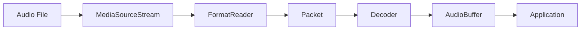

Symphonia is a 100% pure Rust audio decoding and multimedia format demuxing framework. It provides high-performance, safe, and reliable audio processing capabilities for Rust applications.

## What is Symphonia?

Symphonia is a pure Rust audio decoding and media demuxing library that supports a wide variety of audio codecs and container formats including AAC, ADPCM, AIFF, ALAC, CAF, FLAC, MKV, MP1, MP2, MP3, MP4, OGG, Vorbis, WAV, and WebM.

The library creates a clear separation between demuxing (reading container formats) and decoding (converting codec bitstreams to audio samples), allowing you to mix and match different formats and codecs as needed.

## Key Features

<CardGroup cols={2}>
  <Card title="Pure Rust" icon="rust">
    100% safe Rust with no unsafe code, providing memory safety and security guarantees.
  </Card>
  
  <Card title="High Performance" icon="gauge-high">
    Performance comparable to or faster than popular C-based implementations like FFmpeg (+/-15%).
  </Card>
  
  <Card title="Wide Format Support" icon="file-audio">
    Decode support for the most popular audio codecs with automatic format and decoder detection.
  </Card>
  
  <Card title="Gapless Playback" icon="play">
    Support for gapless playback on compatible formats and codecs.
  </Card>
  
  <Card title="Minimal Dependencies" icon="box">
    Lean dependency tree with optional features to keep your builds small.
  </Card>
  
  <Card title="Rich Metadata" icon="tags">
    Read most metadata and tagging formats including ID3v1, ID3v2, Vorbis comments, and more.
  </Card>
</CardGroup>

## Supported Formats

By default, Symphonia only enables support for royalty-free open standard codecs and formats. Additional formats can be enabled using feature flags.

### Container Formats (Demuxers)

| Format   | Status    | Gapless | Default |
|----------|-----------|---------|--------|
| AIFF     | Great     | Yes     | No     |
| CAF      | Good      | No      | No     |
| ISO/MP4  | Great     | No      | No     |
| MKV/WebM | Good      | No      | Yes    |
| OGG      | Great     | Yes     | Yes    |
| Wave     | Excellent | Yes     | Yes    |

### Audio Codecs (Decoders)

| Codec    | Status    | Gapless | Default |
|----------|-----------|---------|--------|
| AAC-LC   | Great     | No      | No     |
| ADPCM    | Good      | Yes     | Yes    |
| ALAC     | Great     | Yes     | No     |
| FLAC     | Excellent | Yes     | Yes    |
| MP1      | Great     | No      | No     |
| MP2      | Great     | No      | No     |
| MP3      | Excellent | Yes     | No     |
| PCM      | Excellent | Yes     | Yes    |
| Vorbis   | Excellent | Yes     | Yes    |

<Note>
  Gapless playback requires support from both the demuxer and decoder.
</Note>

## When to Use Symphonia

Symphonia is ideal for:

- **Audio Players**: Build music players, podcast players, or any application that needs to decode and play audio files
- **Audio Processing**: Implement audio analysis, transcoding, or conversion tools
- **Game Development**: Integrate audio decoding into game engines
- **Embedded Systems**: Leverage Rust's safety guarantees for embedded audio applications
- **Cross-Platform Applications**: Build once and deploy to multiple platforms with consistent behavior

## Architecture Overview

Symphonia's architecture separates concerns into distinct components:

1. **Media Source**: Provides the raw data stream (files, network streams, etc.)
2. **Format Reader (Demuxer)**: Reads container formats and extracts codec packets
3. **Decoder**: Converts codec packets into raw audio samples
4. **Sample Buffers**: Provide convenient access to decoded audio data

## Quality and Safety

Symphonia prioritizes:

- **Correctness**: Decode media as correctly as leading free-and-open-source decoders
- **Security**: Prevent denial-of-service attacks through robust error handling
- **Testing**: Comprehensive fuzz testing to ensure stability
- **API Design**: Powerful, consistent, and easy-to-use APIs

## Get Started

<CardGroup cols={2}>
  <Card title="Installation" icon="download" href="/installation">
    Add Symphonia to your Rust project and configure feature flags
  </Card>
  
  <Card title="Quick Start" icon="rocket" href="/quickstart">
    Build your first audio decoder in minutes
  </Card>
  
  <Card title="API Reference" icon="code" href="https://docs.rs/symphonia">
    Explore the complete API documentation
  </Card>
  
  <Card title="Examples" icon="folder" href="https://github.com/pdeljanov/Symphonia/tree/master/symphonia/examples">
    View working code examples on GitHub
  </Card>
</CardGroup>

## Community and Support

Symphonia is an open-source project licensed under the MPL v2.0. Contributions are welcome!

- **GitHub Repository**: [pdeljanov/Symphonia](https://github.com/pdeljanov/Symphonia)
- **Documentation**: [docs.rs/symphonia](https://docs.rs/symphonia)
- **Crate**: [crates.io/crates/symphonia](https://crates.io/crates/symphonia)

## Minimum Rust Version

Symphonia requires Rust 1.53.0 or later.
